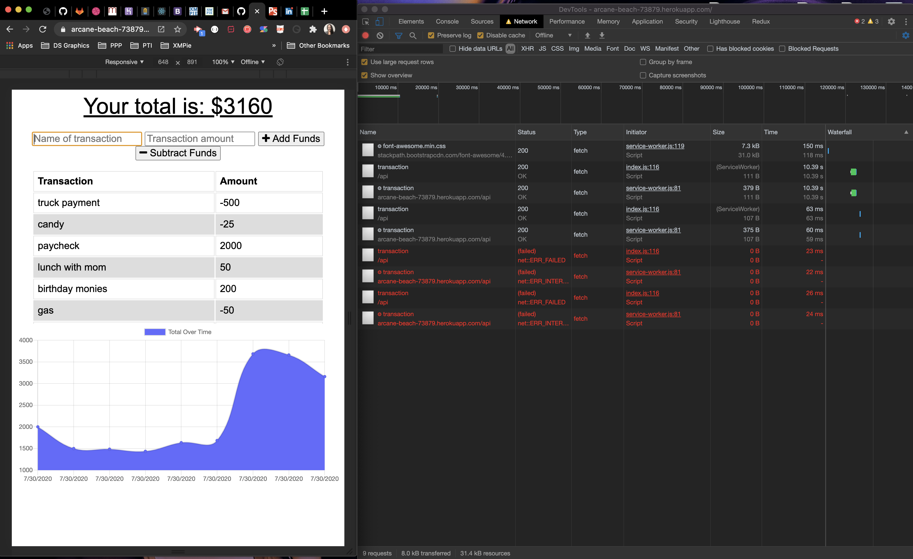
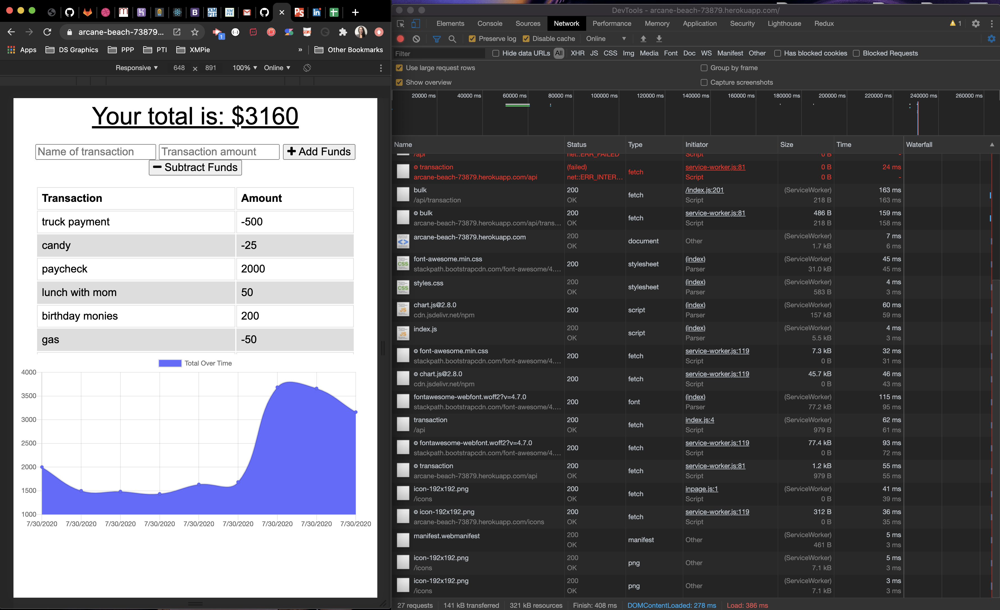

# online-offline-budget-tracker

* Offline :

* Back Online:

## Table of Contents:
* [Description](##Description)
* [Built With](##Built-With)
* [Usage](##Usage)
* [Contributors](##Contributors)
* [Acknowledgments](##Link-to-Page)
* [Link to Page](##Link-to-Page)

## Description
This budegt app enables a user to add and subtract their expenses online or offline, incase they need to use the app where there's no service.

* Offline Functionality: Enter deposits and expenses offline
* When brought back online: Offline entries added to tracker

## Usage
The user is able to add expenses and depositsto their budget while online or offline, and updates total when brough back online. Updated application has offline access and functionality.

## Contributors
* **Karla McLeod** - [kmcleod81](https://github.com/kmcleod81)

## Acknowledgments
* The db file from week 17 mini project

## Link to Heroku Page
* https://arcane-beach-73879.herokuapp.com/

